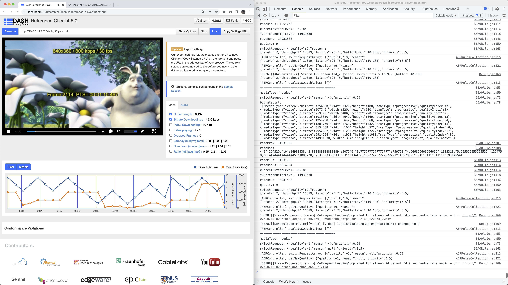
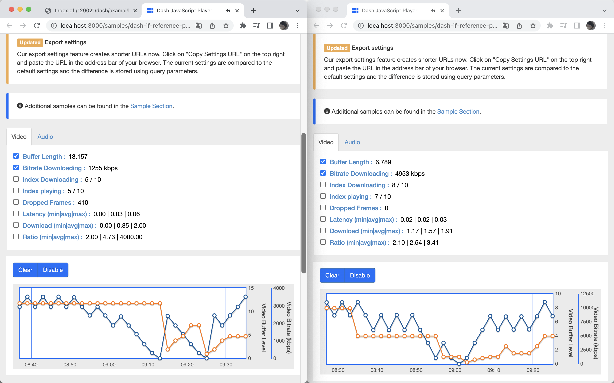
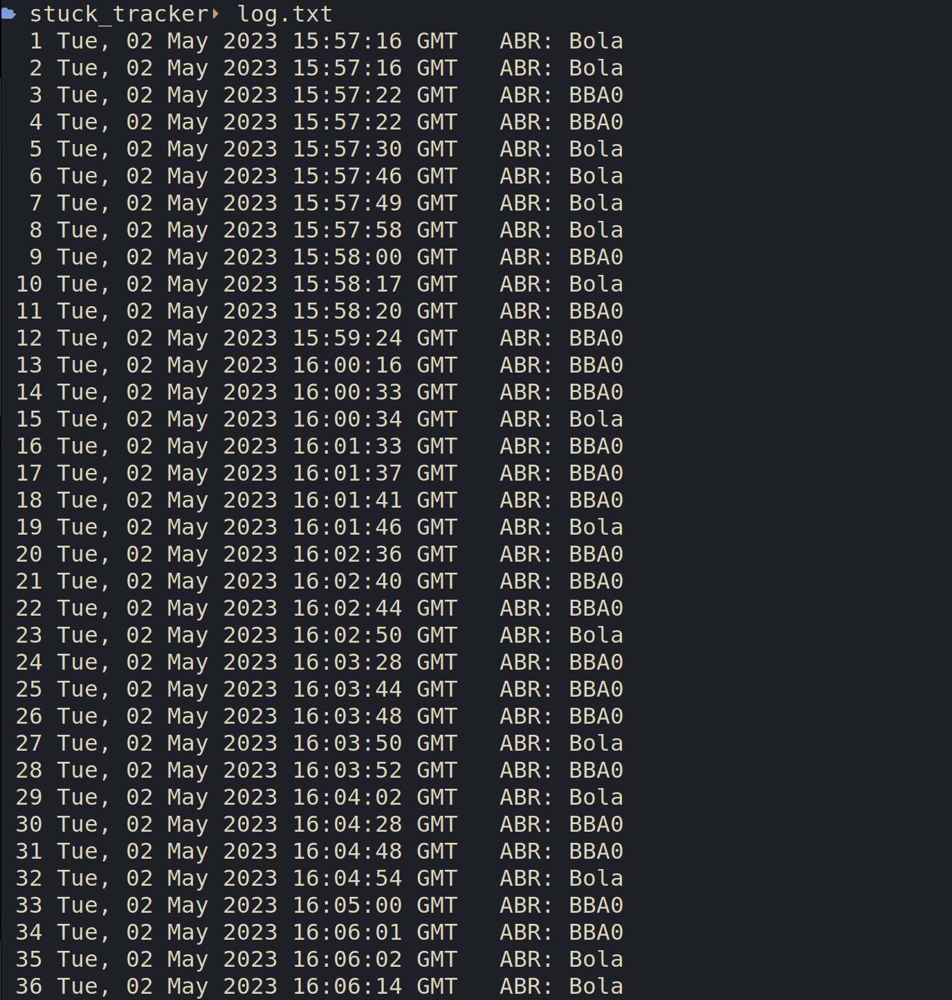

# Dash.js fork

This repository is a fork of [dash.js](https://github.com/Dash-Industry-Forum/dash.js) v4.6.0,
this repository was not suitable to be public when started,
so the forking process is not done on GitHub, which forces the fork to be public.

This fork is for educational purposes only.

The original README of dash.js can be found [here](./original_README.md).

My [notes](./NOTES.md) while reading the source code.

## Modification

Add another ABR algorithm `./src/streaming/rules/abr/BBA0Rule.js`, with the BBA-0 algorithm described
in [A Buffer-Based Approach to Rate Adaptation](https://web.stanford.edu/class/cs244/papers/sigcomm2014-video.pdf).

I also modified the frontend HTML and controller to allow the BBA-0 ABR rule to be selected from the UI.

## Run this

### Server side

Nginx server is used as the backend video streaming service provider, the configurations of nginx are as follows.

```
❯ nginx -V
nginx version: nginx/1.18.0 (Ubuntu)
built with OpenSSL 3.0.2 15 Mar 2022
TLS SNI support enabled
configure arguments: --with-cc-opt='-g -O2 -ffile-prefix-map=/build/nginx-d8gVax/nginx-1.18.0=. -flto=auto -ffat-lto-objects -flto=auto -ffat-lto-objects -fstack-protector-strong -Wformat -Werror=format-security -fPIC -Wdate-time -D_FORTIFY_SOURCE=2' --with-ld-opt='-Wl,-Bsymbolic-functions -flto=auto -ffat-lto-objects -flto=auto -Wl,-z,relro -Wl,-z,now -fPIC' --prefix=/usr/share/nginx --conf-path=/etc/nginx/nginx.conf --http-log-path=/var/log/nginx/access.log --error-log-path=/var/log/nginx/error.log --lock-path=/var/lock/nginx.lock --pid-path=/run/nginx.pid --modules-path=/usr/lib/nginx/modules --http-client-body-temp-path=/var/lib/nginx/body --http-fastcgi-temp-path=/var/lib/nginx/fastcgi --http-proxy-temp-path=/var/lib/nginx/proxy --http-scgi-temp-path=/var/lib/nginx/scgi --http-uwsgi-temp-path=/var/lib/nginx/uwsgi --with-compat --with-debug --with-pcre-jit --with-http_ssl_module --with-http_stub_status_module --with-http_realip_module --with-http_auth_request_module --with-http_v2_module --with-http_dav_module --with-http_slice_module --with-threads --add-dynamic-module=/build/nginx-d8gVax/nginx-1.18.0/debian/modules/http-geoip2 --with-http_addition_module --with-http_gunzip_module --with-http_gzip_static_module --with-http_sub_module
```

The configuration file is `./nginx.conf`.

Use this command to start nginx server: `sudo nginx -p . -c ./nginx.conf`.

And this command to stop it: `sudo nginx -s quit`.

To simulate unstable network where ABR algorithms are actually needed,
the server-side also runs a script(`./tcscript.py`) based on [TC](https://man7.org/linux/man-pages/man8/tc.8.html),
which limits the output throughput of the server by an inconsistent rate.

The network controller name may be different on various devices, in my case:

```
wlp0s20f3: flags=4163<UP,BROADCAST,RUNNING,MULTICAST>  mtu 1500
        inet 10.0.0.19  netmask 255.255.255.0  broadcast 10.0.0.255
        inet6 fe80::5431:69d6:b6a:f675  prefixlen 64  scopeid 0x20<link>
        ether fc:44:82:b5:e0:23  txqueuelen 1000  (Ethernet)
        RX packets 7965340  bytes 9110542887 (9.1 GB)
        RX errors 0  dropped 570  overruns 0  frame 0
        TX packets 3847684  bytes 6882510824 (6.8 GB)
        TX errors 0  dropped 0 overruns 0  carrier 0  collisions 0
```

So the name `wlp0s20f3` will be used in the tc commands.

Use this command to start the python3 script: `sudo python3 ./tcscript.py`.
The python version I used is `Python 3.10.9 [GCC 11.2.0] on linux`,
but this script does not have a strong requirement of specific version of python.

### Client side

In my case, the client runs on macOS 12.6.5
with node.js 16.19.1 installed by [nvm](https://github.com/nvm-sh/nvm).

To run this, first `npm install`, and then `npm run start`.



## Benchmarking

I did a drag race between the BBA0 algorithm I implemented
and the default BOLA algorithm in Dash.js.
My approach is to send a post request to a discrete logging service
every time the buffer is empty
(which also means the video stuck, and the user had a bad experience).
The post request contains which algorithm is sending the request.

Testing BOLA (left) and BBA0 (right) side by side.



[The logger](https://github.com/3DRX/stuck_tracker),
implemented in node.js with express,
stores each post message in a new line of `log.txt`.



After the test finished, another program can parse `log.txt`
and compare the likelihood of BOLA and BBA0 cause a stuck.

